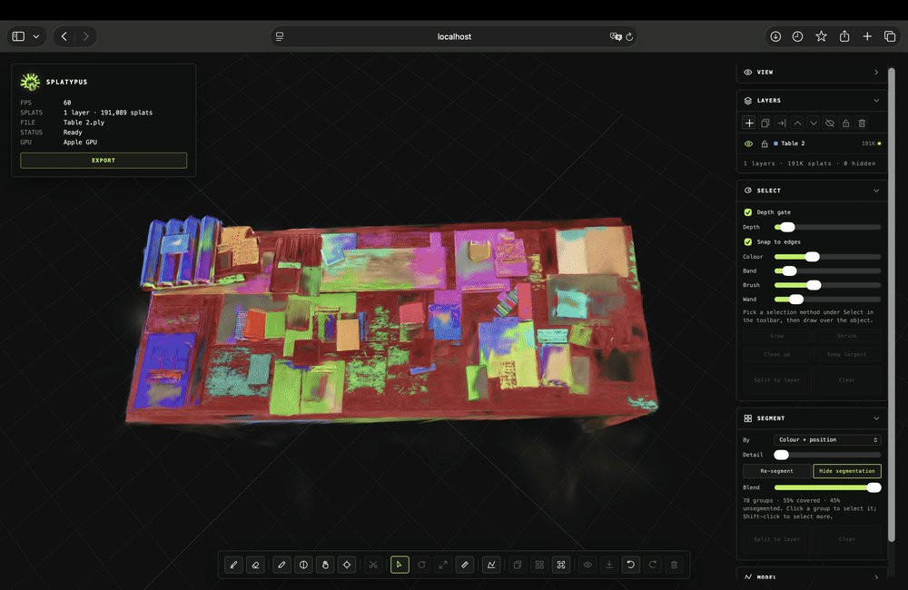
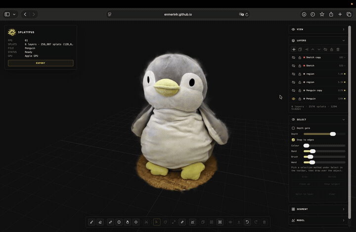
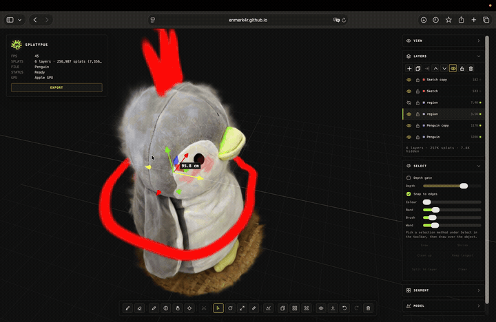
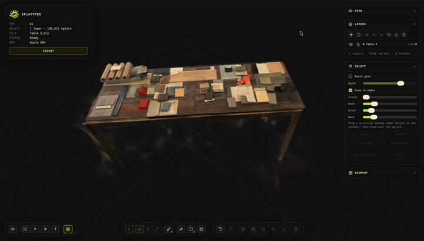

<p align="center">
  
</p>

<h1 align="center">Splatypus</h1>

<p align="center"><strong>Noobs redline drawings. Pros redline reality.</strong></p>

<p align="center">
  A local-first, in-browser editor for Gaussian splats — open a scan of a real place, pull the objects out of it,
  draw and model on top of it in 3D, and export a standard file. Nothing leaves your machine.
</p>

<p align="center">
  <a href="https://enmerk4r.github.io/splatypus/"><strong>▶ Live app</strong></a>
  &nbsp;·&nbsp;
  <a href="#quick-start">Quick start</a>
  &nbsp;·&nbsp;
  <a href="#a-tour-of-the-tools">Tour</a>
  &nbsp;·&nbsp;
  <a href="#controls">Controls</a>
  &nbsp;·&nbsp;
  <a href="#development">Development</a>
  &nbsp;·&nbsp;
  <a href="#team">Team</a>
  &nbsp;·&nbsp;
  <a href="#license">License</a>
</p>

<p align="center">
  <a href="https://github.com/enmerk4r/splatypus/actions/workflows/pages.yml"></a>
  
  
  
  
  <a href="LICENSE"></a>
</p>

<table>
  <tr>
    <td width="50%"></td>
    <td width="50%"></td>
  </tr>
  <tr>
    <td align="center"><sub><strong>Segment</strong> — one click (or one bake) turns a scan into objects you can grab.</sub></td>
    <td align="center"><sub><strong>Sketch</strong> — redline directly on the surface of reality.</sub></td>
  </tr>
  <tr>
    <td width="50%"></td>
    <td width="50%"></td>
  </tr>
  <tr>
    <td align="center"><sub><strong>Rearrange</strong> — split an object to its own layer, duplicate it, move it.</sub></td>
    <td align="center"><sub><strong>Model</strong> — draw a face, pull it into a solid, right inside the scan.</sub></td>
  </tr>
</table>

## Team

Built at the **AECtech 2026 Boston** hackathon by (alphabetically):

- [**Chloe Ni**](https://www.linkedin.com/in/jiayueni/) — Harvard GSD
- [**Habib Nahouta Tresor, EIT**](https://www.linkedin.com/in/habib-nahouta-tresor/) — InfraTracker
- [**Hairu Wang**](https://www.linkedin.com/in/hairu-wang-4ba6a8229/) — PARADIGM Structural Engineers, Inc.
- [**Harish Palani**](https://www.linkedin.com/in/harish-palani-6b34b2207/) — Perkins&Will
- [**Sergey Pigach**](https://www.linkedin.com/in/sergey-pigach-9ab07448) — CORE studio | Thornton Tomasetti

---

## Why

**Capturing on-site conditions is hard.** Photos are static and impossible to measure. The BIM
model may not reflect what was actually built, and has none of the texture, scale or context of
the real room. A LiDAR survey is accurate but needs expensive hardware, special software and
produces mountains of data.

**There is a better way.** Record a short video on the phone you already have → generate a
Gaussian splat → _segment it into objects_ → _annotate it in 3D_. Splats are fast and photoreal,
but out of the box they are mush: blobs of colour in space, no surface topology, no discrete
objects to select, and almost nothing to edit them with in an ordinary viewer.

Splatypus is the editor for that last two steps. It runs entirely in the browser, works offline
after the first load, and never uploads your scan anywhere.

## What it does

- **Opens the common splat formats** — `.ply` (standard and compressed 3DGS), `.spz`, `.splat`,
  `.ksplat`, `.sog`, plus RGB point clouds from LiDAR / CloudCompare — by drag-and-drop, file
  picker or `?url=`. Multi-million-splat scenes load through a level-of-detail tree.
- **Layers** — every file, sketch, split object and mesh is a layer with visibility, lock,
  transforms (move / rotate / scale gumball), duplicate, merge, array and full undo/redo.
- **Selection that follows the object** — magic wand, lasso, polygon, rectangle and brush
  selection with a depth gate and edge snapping; or **AI select**: click an object and SAM lifts
  it out of the scan, with CLIP naming it ("Chair", "Monitor") in the background.
- **Segmentation** — partition a whole layer into surface patches or connectivity groups,
  colour them, hover to read names, click to select, split to layer.
- **Sketch and edit brushes** — ink, tube, marker and spray strokes drawn on the surface, at a
  locked depth or on a work plane; recolor, fade, grab, inflate and erase splats under a brush.
- **Measure / scale to reference** — click two points, type the real distance, the scan is true
  to size.
- **Model** — draw a polyline, rectangle, polygon or circle on the ground, a surface or a tilted
  work plane (Rhino-style typed dimensions, ortho mode), then pull it into a capped solid with an
  arrow gizmo. Meshes live next to splats and become splats on export.
- **Crop**, **snap to floor**, **isolate**, **array** — the everyday scene-prep actions.
- **Export** a standard 3DGS PLY for any other viewer, or a `.splatypus` project that keeps
  every layer, mesh, group and stroke editable.

## Quick start

### Use it online

Open **<https://enmerk4r.github.io/splatypus/>**, drop a file onto the page or pick a sample
from the gallery. Desktop Chrome is the best experience (WebGPU for the AI tools, File System
Access for export); Firefox and Safari work with fallbacks.

Deep links: `?sample=<name>` opens a gallery entry, `?url=<encoded-url>` opens any CORS-enabled
remote file, and `?groups=<encoded-url>` attaches a segmentation sidecar to it.

### Run it locally

Node **20 LTS** is the supported runtime.

```sh
git clone https://github.com/enmerk4r/splatypus.git
cd splatypus/app
npm ci
npm run dev          # http://localhost:5173
```

Production build and local preview:

```sh
npm run build        # type-check + vite build → app/dist
npm run preview
```

### Get a splat of your own space

Splatypus edits splats; it does not train them. Any 3DGS pipeline works — capture a video or
photo set with a phone app such as Polycam, Scaniverse, Luma or KIRI, or train locally with
Postshot / Nerfstudio / gsplat — then open the resulting `.ply` / `.spz` / `.splat` here.
Most phone exports are Y-down 3DGS, which is the default up-axis; LiDAR point clouds are usually
Z-up and are detected as such (VIEW › Up axis overrides either).

## A tour of the tools

The bottom toolbar is split in two. **Tools** on the left: Select (with its Move | Rotate |
Scale gumball modes and a flyout of selection methods), AI select, Brush (flyout of the paint and
edit brushes), Measure, Model (flyout of outline shapes), Work plane, Crop. **Actions** on the
right: Undo / Redo, Duplicate, Array, Split to layer, Isolate, Snap to floor, Delete. A status
line above the bar names the active tool and its keys for a moment after you switch. The camera
cluster bottom-left toggles orbit / fly, frames the scene, jumps to the front / right / top views
and toggles the grid. The right-hand VIEW, LAYERS and SEGMENT panels are always there; SELECT,
SKETCH and MODEL appear only while their tool is in use. Hover anything for its label and key.

### Load and navigate

Drop a file or press `O`. Dropping several files adds each as a layer; `Shift`-drop adds one
file to the current scene; a plain single drop replaces it (after an unsaved-changes check).
Orbit with the left button, pan with the right, zoom to the cursor with the wheel, double-click
to move the orbit target onto the surface. `Tab` flips into **fly** mode (`WASD` + `QE`, `Shift`
for 4×, `Esc` to come back). `F` frames the scene; `1` / `3` / `7` are the front / right / top
views; `G` toggles the grid.

### Layers and transforms

The **LAYERS** panel lists the topmost layer first. Click to select, `Ctrl/Cmd`-click to toggle,
`Shift`-click for a range, double-click to rename. Its toolbar adds, duplicates, merges, deletes
and reorders; **SOLO** shows only one layer, **FLOOR** drops a layer onto the grid plane, **×5**
lays out four more copies in a row. The gumball appears when exactly one unlocked layer is
selected: `W` / `E` / `R` switch move / rotate / scale, and the viewer shows the distance, angle
or factor while you drag. Uniform scale stays a transform; non-uniform scale is baked into the
splats on release (covariances re-diagonalised) as one undo step. Selected layers are obvious:
a mesh gets thick glowing lime edges, a splat layer is nudged towards lime and brightened — a
shader uniform, so it costs nothing and the detail stays legible.

### Select

Pick a method under **Select ▾**: **Magic wand**, **Rectangle**, **Lasso**, **Polygon** or the
**Selection brush**. `Shift` adds, `Alt` removes, `Esc` cancels. Each gesture is one-shot — as
soon as a selection lands the pointer goes back to the camera. Two helpers run behind every
gesture in the **SELECT** panel: **Depth gate** keeps only the front surface under the shape (a
lasso around a chair does not also grab the wall behind it) and **Snap to edges** lets the
boundary settle onto a real colour edge in the cloud instead of the line your hand drew. Then
**Grow** / **Shrink**, **Clean up** (drop small islands), **Keep largest**, and **Split to
layer** to lift the selection into its own layer. The smart tools index a layer the first time
they touch it (~0.6 s per 250 k splats, cached) and decline above 600 k live splats. Details:
[docs/REGION_SELECT_NOTES.md](docs/REGION_SELECT_NOTES.md).

### AI select (`J`)

Click an object and it is selected — the idea of
[ArtisanGS](https://arxiv.org/abs/2602.10173) (NVIDIA + U Toronto): segment in 2D, lift the
mask into 3D. Picking the tool locks the camera, renders the view offscreen and encodes it with
**SAM** (`Xenova/slimsam-77-uniform` via transformers.js on ONNX Runtime Web — WebGPU where
available, CPU otherwise). **Click** the object, **Alt-click** a region SAM wrongly included,
`[` / `]` to step through the three masks SAM proposes, **Enter** to commit. The result is an
ordinary group, so hover, split, export and project save all work on it; `Ctrl+Z` undoes it. In
the background **CLIP** (`Xenova/clip-vit-base-patch32`) names the object from a curated
room-object vocabulary (turn off with **Name objects** in SEGMENT). **Segment everything** runs a
grid of prompts over the view and turns every surviving object into a group, tightest-first so a
blob never swallows a chair. **Depth** and **Grow** in SEGMENT decide what "behind the mask"
means. The models (tens of MB) come from the Hugging Face CDN on first use and are cached by the
browser; nothing downloads until you pick the tool, and every other tool works offline. It is
single-view: the far side of the chair is not selected. Background and measurements:
[docs/AI_SELECT_NOTES.md](docs/AI_SELECT_NOTES.md).

### Segment

The **SEGMENT** panel partitions the active layer. **Surface patches** (default) walks the same
colour-aware neighbour graph the selection tools use, from seeds spread through the cloud, so
every splat lands in a patch (99.8 % coverage on the sample scene in ~0.2 s). **Colour +
position** / **Colour only** / **Position only** is the connectivity bake, which finds only the
confidently uniform regions and is the one that still works above the 600 k graph limit.
**Detail** sets the patch count or cell size; **Show segmentation** paints every group in its own
colour with a **Blend** slider. Hover a group for its name, click to select it, **Split to
layer** to lift it out (re-originned on its centroid, so the gumball sits on the object). Offline
you can bake a `.groups` sidecar with `node tools/bake-connectivity.mjs scan.ply scan.groups`
(format: [docs/GROUPS_FORMAT.md](docs/GROUPS_FORMAT.md)); it loads automatically next to a
`?url=` scan or by drop. Notes: [docs/SEGMENTATION_NOTES.md](docs/SEGMENTATION_NOTES.md).

### Sketch and edit brushes

**Brush ▾ Sketch** (`S`) draws with the left button; right-drag, middle-drag or `Alt`-drag keep
the camera available. The **SKETCH** panel sets the preset — **Ink** (camera-facing ribbon),
**Tube** (round, view-independent), **Marker** (wide, translucent), **Spray** (scattered blobs) —
colour, world-space size (`[` `]`), opacity (`Shift` + `[` `]`), pressure response and
placement: **Surface** follows the scan and bridges small gaps, **Lock depth** draws on a
camera-facing plane through the first hit, **Plane** draws on the work plane (or the ground).
The first stroke creates an undoable `Sketch` layer; later strokes append to it. The other
brushes edit the **active layer** under the same ring: **Erase** (`X`) hides splats, **Recolor**
(`C`) tints towards the sketch colour, **Fade** (`D`) lowers opacity, **Grab** (`V`) drags splats
along the screen, **Inflate** (`I`) grows them (`Shift` reverses the last three). Every gesture
is one undo step. Details: [docs/PHASE4_NOTES.md](docs/PHASE4_NOTES.md).

### Measure / scale to reference (`M`)

Click two points on the active layer — a lime target marks the splat the pointer is snapped to,
the readout shows the live distance — then type the real distance and **Scale layer**: the layer
is scaled uniformly about the first point so the two points are that far apart. Do this first on
phone scans so everything you draw afterwards is at true size.

### Model (`P`) and the work plane (`K`)

Pick a shape in the **Model ▾** flyout — freeform **polyline** (click the ringed start point,
double-click or `Enter` to close; `Backspace` removes a point), **rectangle**, regular
**polygon** or **circle**. Outlines land on a horizontal plane at the height of whatever is
under the first click, or on the **work plane** when it is shown (`K`: move or rotate it with its
gizmo, snap it to Ground / Front / Side or square it to the camera) so you can draw straight onto
a wall or a sloped roof. Rhino-style numeric entry: once the first point is down, type `2.25` and
the next click only sets the direction; a rectangle takes `2,1.5` or two numbers with `Enter`
between. **Ortho** keeps polyline segments axis-aligned and snaps gumball rotations to 15°
(hold `Shift` to flip it temporarily). Closing the outline makes a translucent **face** layer:
move or rotate it like any layer, then pull the lime arrow at its centroid (or type a height in
MODEL) as many times as you like, **Confirm** (`Enter`) to finalise or **Reset** to flatten.
Extrusion is always along the face's own normal. The result is a capped **mesh layer** — moved,
scaled (non-uniformly too), duplicated, hidden and undone like any layer — stored as a mesh in
the project and sampled into flat gaussians on PLY export or merge.
Details: [docs/MESH_NOTES.md](docs/MESH_NOTES.md).

### Crop, array, floor

**Crop** shows a box gizmo (move / resize); **Keep inside** / **Cut inside** hide everything on
the wrong side of it in every visible unlocked layer. **Array** copies the active layer into a
columns × rows grid; **Snap to floor** drops it onto the grid plane; **Isolate** shows only the
active layer (click again to show all). Hidden splats are never exported; everything is undoable.

### Export

**EXPORT** in the HUD or `Ctrl/Cmd+E` offers two explicit choices:

|               | **PLY** — standard 3DGS (`.ply`)                     | **Splatypus project** (`.splatypus`)                                   |
| ------------- | ---------------------------------------------------- | ---------------------------------------------------------------------- |
| For           | Any other splat viewer or tool                       | Coming back to edit later                                              |
| Layers        | Merged into one cloud; meshes converted to splats    | Kept as separate layers; meshes stay meshes                            |
| Keeps         | Live splats, colour, SH (optional), layer transforms | Everything: transforms, visibility, groups, strokes, selection, camera |
| Hidden splats | Dropped (or included, by option)                     | Kept                                                                   |

PLY output is binary little-endian, includes only live splats and bakes each layer's
translate / rotate / uniform-scale into its splats (not the viewer-only up-axis transform).
Chrome uses the File System Access API; Firefox and Safari fall back to a download.

## Controls

| Input                                               | Action                                                                                                                                                                                     |
| --------------------------------------------------- | ------------------------------------------------------------------------------------------------------------------------------------------------------------------------------------------ |
| Left drag                                           | Orbit in Select; draw / erase / select with a tool active; look around in fly mode                                                                                                         |
| Right drag · Middle drag · `Alt`+left drag          | Pan · Dolly · Orbit while a tool is active                                                                                                                                                 |
| Scroll · Double-click                               | Zoom to cursor (fly: change speed) · Move the orbit target onto the surface                                                                                                                |
| Click                                               | Select the layer under the cursor — and its group, when the layer is segmented                                                                                                             |
| `F` · `G` · `1` `3` `7`                             | Frame the scene · Toggle the grid · Front / right / top view                                                                                                                               |
| `Tab` · `W` `A` `S` `D` · `Q` `E` · `Shift` · `Esc` | Fly mode: toggle · move · down / up · 4× speed · back to orbit                                                                                                                             |
| `Q` · `W` `E` `R`                                   | Select tool · Move / Rotate / Scale gumball                                                                                                                                                |
| `S` `X` `C` `D` `V` `I`                             | Sketch · Erase · Recolor · Fade · Grab · Inflate                                                                                                                                           |
| `M` · `P` · `J` · `K`                               | Measure · Model · AI select · Work plane                                                                                                                                                   |
| `[` `]` · `Shift`+`[` `]`                           | Brush size · Brush opacity (AI select: cycle masks)                                                                                                                                        |
| `O` · `Shift+O`                                     | Open a file · Add files as layers                                                                                                                                                          |
| `Delete` / `Backspace`                              | Delete selected unlocked layers                                                                                                                                                            |
| `Ctrl/Cmd+Z` · `Ctrl/Cmd+Shift+Z` / `Ctrl/Cmd+Y`    | Undo · Redo                                                                                                                                                                                |
| `Ctrl/Cmd+E`                                        | Export                                                                                                                                                                                     |
| `Esc`                                               | Back out one level: close a flyout / cancel the crop box → cancel the stroke, outline or measurement → leave the tool (back to Select) → clear the selection; in fly mode, return to orbit |

## How it is built

- **[Vite](https://vitejs.dev) + TypeScript (strict) + [three.js](https://threejs.org)**, with
  **[Spark](https://sparkjs.dev)** (World Labs) rendering the splats. Spark's `dyno` shader graph
  is what lets segmentation colours, selection tint and hidden splats be a uniform or a texture
  lookup instead of a rebuild.
- **Local-first.** Files are decoded in a Web Worker; float32 CPU arrays — not the quantised
  render texture — are the source of truth, so edits, exports and re-imports are lossless for
  PLY / SPZ / SPLAT. Remote files are fetched only when you pass `?url=`.
- **AI in the browser.** SAM and CLIP run through
  [transformers.js](https://huggingface.co/docs/transformers.js) on ONNX Runtime Web (WebGPU →
  wasm fallback). No server, no API key.
- **Undo everything.** Every edit is a command on a history stack; layers, transforms, strokes,
  selections, segmentations, crops and meshes all round-trip through it.
- Lightweight panels with [Tweakpane](https://tweakpane.github.io/docs/); no UI framework.

```
app/                 the web app (Vite project)
  src/ai/            SAM + CLIP sessions, frame capture, vocabulary
  src/io/            PLY / SPZ / SPLAT / KSPLAT / SOG decoding, PLY + .splatypus export
  src/model/         Document, Layer, SplatStore, undoable commands
  src/select/        region selection, AI select, segmentation, crop
  src/sketch/        brushes, strokes, measure tool, overlay canvas
  src/mesh/          outline tool, extrusion gizmo, solids
  src/viewer/        Viewer, camera rig, gizmos, work plane, picking
  src/ui/            toolbar, panels, dialogs, shortcuts, HUD
  tests/             vitest suites
assets/              demo GIFs and the logo used by this README
docs/                design notes and format specs per feature
tools/               bake-connectivity.mjs — offline .groups baker
```

## Development

```sh
cd app
npm run dev          # dev server with HMR
npm test             # vitest (unit tests for IO, selection, segmentation, meshes, …)
npm run lint         # eslint --max-warnings 0 + prettier --check
npm run format       # prettier --write
npm run build        # tsc -b && vite build
```

Line endings are normalised to LF by `.gitattributes`, so Windows clones stay prettier-clean.
Every push to `main` runs the tests, builds `app/` and deploys `app/dist` to GitHub Pages
([workflow](.github/workflows/pages.yml)); Vite uses a relative base so the same build works on a
project page or a custom domain. The design notes in [`docs/`](docs/) explain the _why_ behind
each subsystem (region selection, segmentation, AI select, meshes, the `.groups` format); the
broader roadmap is in [PLAN.md](PLAN.md).

## Performance notes

- **Check the GPU row in the HUD first.** Dual-GPU laptops often run Chrome on the integrated
  GPU (`ANGLE (Intel …)`), several times slower for splats — force the discrete one in Windows
  _Settings → System → Display → Graphics_ and restart Chrome.
- Files above 1.5 M splats load through Spark's level-of-detail tree (built in a worker, ~1–3 s
  per million splats) and render a view-dependent subset. Tints and labels are not drawn on
  LoD-rendered layers, though selection and split still work.
- **RGB point clouds** become small isotropic gaussians sized from point spacing, capped at a
  point budget (default 3 M, adjustable in _VIEW › Point cloud_).
- **Render scale** (_VIEW › Performance_) lowers internal resolution for fill-rate-bound scenes.

## Coordinate convention

3DGS files are normally Y-down; Splatypus rotates the scene 180° about X after loading so the
viewer, grid and controls use three.js Y-up. Source coordinates are never modified, and export
does not bake this viewer-only transform. _VIEW › Up axis_ switches between `Y-down (3DGS)`,
`Y-up` and `Z-up (scans)`.

## Known limitations

- Remote files need CORS headers; otherwise download and drop them.
- ASCII and big-endian PLY are not supported — use binary little-endian.
- KSPLAT / SOG imports start from Spark's quantised representation and are therefore lossy (a
  one-time notice says so).
- Rotating a layer does not rotate its SH coefficients, so view-dependent colour can shift
  slightly after export.
- AI select is single-view and approximate on thin or porous surfaces; without WebGPU (Safari,
  Firefox) inference runs on single-threaded wasm and takes seconds per view.
- Desktop Chrome, Firefox and Safari are the targets; mobile layouts work but are not polished.

## Acknowledgements

[Spark](https://sparkjs.dev) and the sample scenes (World Labs) · [three.js](https://threejs.org)
· [transformers.js](https://huggingface.co/docs/transformers.js) with
[SlimSAM](https://huggingface.co/Xenova/slimsam-77-uniform) and
[CLIP](https://huggingface.co/Xenova/clip-vit-base-patch32) ·
[ArtisanGS](https://arxiv.org/abs/2602.10173) for the lift-a-2D-mask-into-3D idea ·
[Tweakpane](https://tweakpane.github.io/docs/).

## License

[MIT](LICENSE) — use it, fork it, ship it; just keep the notice.
